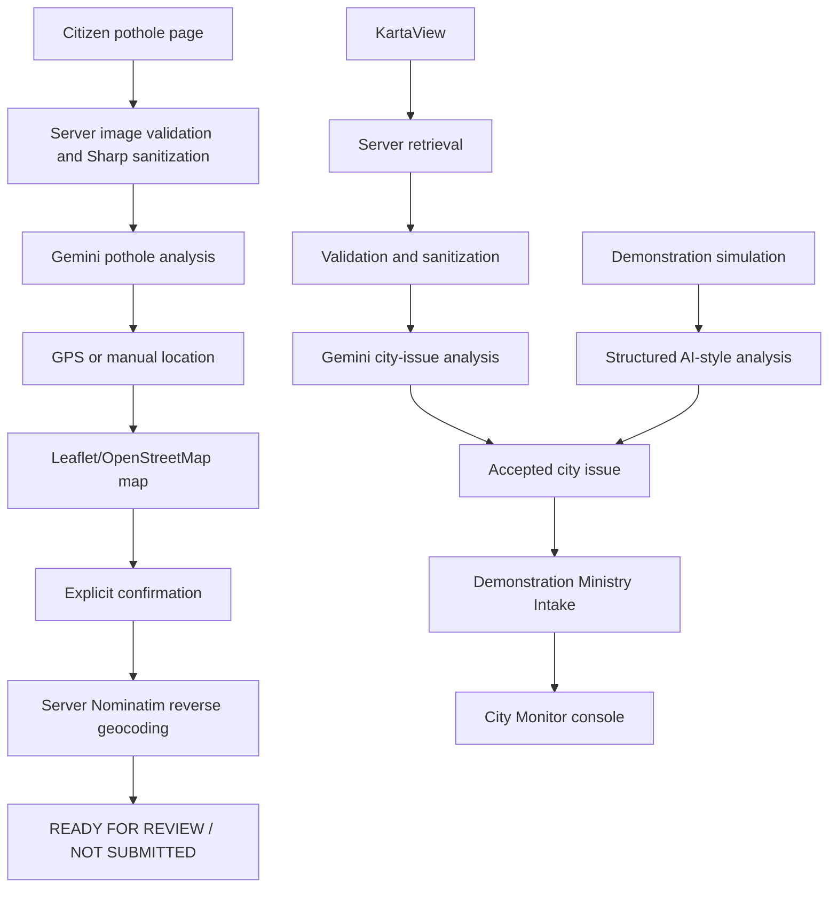

# JalSarthi AI

JalSarthi AI is a bilingual (English/Hindi), citizen-facing assistant for
water-related public information, services, and infrastructure observations.
It combines a Gemini-backed assistant with deterministic service/planning
workflows, a citizen water-accumulating-pothole flow, and a separate city-level
water infrastructure monitor.

The current application provides:

- Normal water-information chat with grounded source cards when the server AI
  provider is configured.
- English/Hindi language support.
- Deterministic water-conservation planning, complaint drafting with
  sensitive-detail redaction, and a verified official-source catalogue.
- Water-accumulating-pothole image analysis with GPS or manually supplied
  location.
- A Lucknow-focused city monitor using KartaView imagery, server-side image
  validation, and structured Gemini visual analysis.
- A local Demonstration Ministry Intake behind the City Monitor console.
- A controlled, deterministic 120-record demonstration dataset for showing the
  complete city-monitor to Ministry flow when external imagery is unavailable.

JalSarthi AI is not an official Government of India service. It does not claim
government authorization or connection to the real Ministry of Jal Shakti.

## Product boundaries

The citizen pothole workflow ends at a review preview. It does not submit a
complaint to the real Ministry of Jal Shakti or to any government system. The
Ministry workflow is a local, server-side **Demonstration Ministry Intake**;
its records are held in memory and reset when the server process restarts.

There is no real government API, government database, authentication system,
government authorization, automatic real-world submission, complaint tracking,
or durable citizen-reporting database. The City Monitor console is a local
read-only view, not the real Ministry website.

KartaView is the implemented external imagery source for the city monitor.
Lucknow coverage is sparse and historical. Historical imagery is never
described as live, and the application makes no citywide or current-live
Lucknow coverage claim. Demonstration records are explicitly labeled
`DEMONSTRATION_SIMULATION`; simulated data is not KartaView data and must not
be presented as a real KartaView or Gemini detection.

## Citizen water-accumulating-pothole workflow

The isolated route is `/assistant/report-water-accumulating-pothole`.

1. The user selects a JPEG or PNG image. WebP and other formats are rejected in
   the browser and again by the server.
2. The server checks the image signature rather than trusting the browser MIME
   value, enforces an 8 MiB input limit, decodes it with Sharp, and enforces an
   8,000-pixel maximum dimension and 24-million-pixel maximum image size.
3. Sharp re-encodes the image as canonical JPEG or PNG bytes. EXIF, XMP, IPTC,
   ICC, and trailing input data are removed; the exact sanitized bytes are
   decoded again before analysis.
4. Sanitized bytes are sent server-side to the Gemini visual analyzer. The
   server decides whether a visible pothole and visible standing water are
   present with sufficient evidence. The response includes classification,
   visibility flags, confidence, severity, description, and eligibility.
5. The user can request one foreground browser GPS position using
   `getCurrentPosition()`. There is no background GPS and no `watchPosition`.
6. Alternatively, the user can enter latitude, longitude, and an area label.
   Coordinates are parsed and range-checked; the area is required and limited
   to 160 characters.
7. Both location paths use the same Leaflet/OpenStreetMap map. The marker can
   be moved, and the user must explicitly confirm the selected coordinates.
   Moving the marker clears prior confirmation and address state.
8. Confirmed coordinates are reverse-geocoded through the server-owned
   `/api/pothole/reverse-geocode` route, which calls Nominatim with a controlled
   URL, timeout, rate spacing, language, and sanitized address length.
9. For manual input, the user-entered area is shown separately from the
   reverse-geocoded address. A warning is displayed when the two do not appear
   consistent; the user-entered area is not treated as authoritative address
   data.
10. A preview is available only after eligible analysis, an image, confirmed
    coordinates, and successful reverse geocoding are present. Its terminal
    labels are `READY FOR REVIEW` and `NOT SUBMITTED`.

Changing or re-analyzing the image clears dependent location, confirmation,
address, and preview state. Removing the image clears the workflow. Stale GPS
and reverse-geocoding responses cannot overwrite newer state. Image previews,
analysis, location, address, and draft state remain in current browser memory;
the workflow does not use localStorage, sessionStorage, cookies, IndexedDB,
analytics, or persistent image storage.

## City Water Infrastructure Monitor

The city monitor is separate from the citizen workflow. Its real-provider path
is:

```text
KartaView metadata
  → server retrieval of the selected image
  → image signature validation, Sharp decoding, and sanitization
  → structured Gemini city-issue analysis
  → accepted city issue
  → deduplication
  → Demonstration Ministry Intake
  → City Monitor console
```

KartaView metadata is obtained from its official photo endpoint. Image URLs
are accepted only from HTTPS KartaView/OpenStreetCam hosts, and remote image
responses are bounded before the shared Sharp validation path is used. Raw
remote image bytes are not stored in the in-memory monitor store; the store
keeps validated metadata, processing records, and accepted issue summaries.
When an accepted KartaView issue is opened in the console, its image is
retrieved again through a JalSarthi server route and revalidated before it is
shown. The browser never calls KartaView directly. If that imagery is no
longer available, the detail view shows a clear unavailable state instead.

The configured city is:

- City: Lucknow, India
- Center: latitude `26.8467`, longitude `80.9462`
- Scan radius: `1,000` metres
- Date windows: bounded `YYYY-MM-DD` start and end dates

This is a small configured scan area, not an administrative boundary. During
validation, the bounded recent Lucknow query returned no imagery. One
historical KartaView image was discovered and analyzed during development.
No fake KartaView records are inserted when coverage is unavailable.

### City issue categories and acceptance

The visual analyzer recognizes exactly these categories:

- `WATER_FILLED_POTHOLE`
- `WATER_LEAKAGE`
- `DRAINAGE_ISSUE`
- `WATERLOGGING`
- `DAMAGED_WATER_INFRASTRUCTURE`
- `OTHER_WATER_RELATED_ISSUE`
- `NO_ISSUE`
- `UNCERTAIN`

An accepted issue must have `detected === true`, a supported positive category
(not `NO_ISSUE` or `UNCERTAIN`), confidence of at least `0.80`, finite valid
latitude and longitude, a non-empty source image identity, and a valid source
timestamp. KartaView issues require a capture time or provider-added time.
The controlled simulation uses its generated/discovered event timestamp and
is labeled separately. KartaView provider metadata and image identity are
validated before analysis, and duplicate provider records are not reprocessed.

## Demonstration Ministry Intake

The local intake accepts an accepted city issue by ID and derives authoritative
issue fields from the server-owned city-monitor store. A caller cannot submit
arbitrary confidence, category, priority, evidence, coordinates, or timestamps
through the intake request.

| Method | Route | Purpose |
| --- | --- | --- |
| `POST` | `/api/ministry/issues` | Forward an accepted `kartaview:<photo-id>` or `demo:lucknow-monitor-<nnn>` city issue. |
| `GET` | `/api/ministry/issues` | Return the local intake summary and safe issue list. |
| `GET` | `/api/city-monitor/issues/:ministryIssueId` | Return safe evidence/detail metadata for one Ministry intake record. |
| `GET` | `/api/city-monitor/issues/:ministryIssueId/image` | Server-side retrieval and revalidation of an available KartaView evidence image. |

Ministry records include source identity, source image identity, category,
confidence, AI description, evidence, coordinates, city/state, capture or
generated/discovered time, analysis time, and Ministry receipt time. IDs use
the form `JSM-LKO-000001` and increment in the in-memory store. Forwarding the
same source issue again returns the existing record instead of creating a
duplicate.

Statuses are `NEW`, `ACKNOWLEDGED`, and `RESOLVED`. The current dashboard is
read-only; there is no status-update endpoint. Priority is derived server-side:

- `HIGH` for `WATER_LEAKAGE` or `WATERLOGGING` with confidence at least `0.90`.
- `MEDIUM` for supported water infrastructure categories including leakage and
  waterlogging below that high-confidence condition.
- `LOW` for other accepted water-related categories.

The source is `KARTAVIEW_CITY_MONITOR` for external observations and
`DEMONSTRATION_SIMULATION` for controlled simulated observations.

## City Monitor console

`/city-monitor` is the judge-facing City Water Infrastructure Monitor. It reads
the local Demonstration Ministry Intake and provides:

- Total, new, high-priority, acknowledged, and resolved issue counts.
- Category breakdown and priority summary.
- Recent issue table with Ministry ID, category, location, priority,
  confidence, source, captured/generated timing, receipt time, and status.
- An issue-level investigation panel with source/image identity, provenance,
  image-validation result, structured analysis, acceptance decision, full
  address/locality, coordinates, Ministry receipt, and a compact processing
  trace.
- An actual KartaView image where the accepted record still has usable source
  imagery. It is delivered through JalSarthi's server route, not by a browser
  call to KartaView. Missing imagery is shown as unavailable.
- Automatic server-owned initialization of the controlled demonstration dataset
  when the console opens, plus explicit manual refresh; the browser does not
  poll or generate records in the background.
- English/Hindi presentation, including an empty state when no accepted issues
  have reached the intake.
- A persistent local-demonstration disclaimer.

Real KartaView issues are labeled KartaView. Simulated issues are labeled
`DEMONSTRATION_SIMULATION` in the table and details, and the console shows the
separate simulation pipeline. Simulation records have no external imagery and
are explicitly described as controlled data rather than KartaView
observations. Address/area and coordinates are shown for every record so the
locality context is easy to inspect.

## Demonstration simulation

The simulation exists to make the complete demonstration possible when sparse
or historical external imagery cannot produce a qualifying observation. It is
a separate, deterministic server-owned dataset of 120 Lucknow records and does
not call KartaView or Gemini for an external image.

| Method | Route | Purpose |
| --- | --- | --- |
| `POST` | `/api/city-monitor/simulate` | Load the controlled Lucknow demonstration dataset. |
| `POST` | `/api/city-monitor/demo` | Compatibility alias for the dataset action. |

The dataset ID is `lucknow-monitor-dataset`. It creates 120 structured
AI-style results across six supported water-infrastructure categories, with
realistic Lucknow localities/addresses, deterministic coordinates, confidence
values from 0.80–0.99, and a mix of `NEW`, `ACKNOWLEDGED`, and `RESOLVED`
statuses. Each accepted issue is automatically forwarded to the Demonstration
Ministry Intake and receives a `JSM-LKO-XXXXXX` ID. Repeating the action is
idempotent: existing records are retained and the response reports them as
duplicates.

Simulation assets use a `simulation://` source identity, provider-isolated
store keys, and `DEMONSTRATION_SIMULATION` source labeling. **Simulated data is
not real KartaView data and must never be presented as a live or historical
external detection.**

## Important routes

### Pages

| Route | Purpose |
| --- | --- |
| `/` | Public JalSarthi AI landing page. |
| `/assistant` | Normal citizen assistant. |
| `/assistant/report-water-accumulating-pothole` | Citizen water-accumulating-pothole workflow. |
| `/city-monitor` | City Water Infrastructure Monitor and demonstration console. |

### API

| Method | Route | Purpose |
| --- | --- | --- |
| `POST` | `/api/chat` | Server-owned normal assistant chat. |
| `POST` | `/api/pothole/analyze` | Validate/sanitize and analyze a citizen image. |
| `POST` | `/api/pothole/reverse-geocode` | Server-owned Nominatim reverse geocoding. |
| `POST` | `/api/city-monitor/ingest` | Discover bounded KartaView imagery for a configured city. |
| `POST` | `/api/city-monitor/analyze` | Ingest and screen configured city imagery. |
| `GET` | `/api/city-monitor/status` | Read city-monitor status and provider/simulation availability. |
| `POST` | `/api/city-monitor/simulate` | Load the controlled demonstration dataset. |
| `POST` | `/api/city-monitor/demo` | Alias for the demonstration dataset endpoint. |
| `GET` | `/api/city-monitor/issues/:ministryIssueId` | Read one safe issue evidence/detail record. |
| `GET` | `/api/city-monitor/issues/:ministryIssueId/image` | Serve an available KartaView image through server-side validation. |
| `POST` | `/api/ministry/issues` | Forward an accepted city issue to the local intake. |
| `GET` | `/api/ministry/issues` | Read the local Ministry intake summary and records. |

## Architecture

The citizen workflow and city-monitor workflow do not share client state or
analysis systems:



The city-monitor store and Ministry store are server-side in-memory stores
behind interfaces. They are not durable databases and reset with the server
process. Provider-qualified store keys keep KartaView and demonstration
records separate.

## Setup

From this directory:

```bash
npm install
cp .env.example .env.local
npm run dev
```

Open [http://localhost:3000](http://localhost:3000). Put real local values in
`.env.local`; do not commit that file. The current environment variable names
are:

| Variable | Use |
| --- | --- |
| `GEMINI_API_KEY` | Server-only Gemini credential for normal chat and visual analysis. |
| `GEMINI_MODEL` | Present in the environment template but not currently read by the providers; the current Gemini provider code uses `gemini-3.5-flash`. |

Never prefix these variables with `NEXT_PUBLIC_`. No secret value belongs in
source control or client code.

## Development and validation

```bash
npm run typecheck
npm run lint
npm run build
npm ls --depth=0
cd ..
git diff --check
```

The current validation status is:

- Typecheck: PASS.
- ESLint: PASS with no warnings or errors. `next lint` reports the framework's
  deprecation notice and is not treated as a lint failure.
- Production build: PASS.
- Dependency tree: inspected; `@emnapi/runtime` may appear as extraneous in
  the local install.
- Whitespace/diff check: PASS.
- Simulation idempotency: verified; repeat runs return the existing Ministry
  issue.
- KartaView/simulation separation: verified through provider/source labels and
  provider-qualified store keys.
- WebP rejection: verified; only JPEG and PNG are accepted.
- `Namaste` is absent from user-facing source.
- No tracked secret values were found.
- No real Ministry submission endpoint exists.
- The citizen pothole route and APIs remain present and intact.

## Current limitations and demo flow

### A. Citizen workflow

Open `/assistant/report-water-accumulating-pothole`, select a JPEG or PNG,
complete server-side eligibility analysis, choose GPS or manual location,
move and confirm the map marker, obtain the reverse-geocoded address, and open
the review preview. The result is `READY FOR REVIEW` and `NOT SUBMITTED`.

### B. Real city-monitor workflow

Use the city-monitor ingestion and analysis APIs for the configured Lucknow
scan. KartaView is the real external source, but current coverage is sparse and
historical; the bounded recent query may return no imagery. Do not describe
returned historical imagery as live and do not create substitute KartaView
records.

### C. City Monitor console

Open `/city-monitor`; the controlled server-owned demonstration dataset is
initialized automatically for the judge-facing run. The Refresh control
re-fetches the current state without creating duplicates. Select **View details** for one issue to
show its source evidence, validation result, structured analysis, acceptance,
address/area, coordinates, processing trace, and local Ministry receipt. A
KartaView image appears only when the server can retrieve it; demonstration
records clearly show that no external imagery is used.

### D. Demonstration simulation

On `/city-monitor`, initialization loads 120 synthetic records and forwards
them automatically to the local intake. The simulation endpoint remains
available for explicit API validation: call
`POST /api/city-monitor/simulate` with `{ "cityId": "lucknow", "scenarioId": "lucknow-monitor-dataset" }`.
Repeating the call leaves the same records in place and reports duplicates.
The console labels every simulated record
`DEMONSTRATION_SIMULATION`; this is the appropriate demonstration path when
real KartaView imagery is unavailable, not a real-world infrastructure claim.

## Security and privacy

- Gemini credentials are read only on the server and are not exposed through
  `NEXT_PUBLIC_` variables or client bundles.
- Citizen images and remote KartaView images are signature-checked, decoded,
  dimension-limited, and re-encoded by Sharp before visual analysis.
- Sanitized image bytes are the bytes passed to Gemini; metadata is removed.
- Provider URLs are constrained to HTTPS KartaView/OpenStreetCam hosts, and
  provider errors are translated to safe application errors.
- Citizen GPS is a single user-initiated request. No background location,
  `watchPosition`, analytics, or persistent location storage is used.
- Reverse-geocoded addresses are sanitized and are requested only after the
  user confirms coordinates.
- No path submits a citizen report or city issue to the real Ministry of Jal
  Shakti. The Ministry backend in this repository is demonstration-only and
  in-memory.
